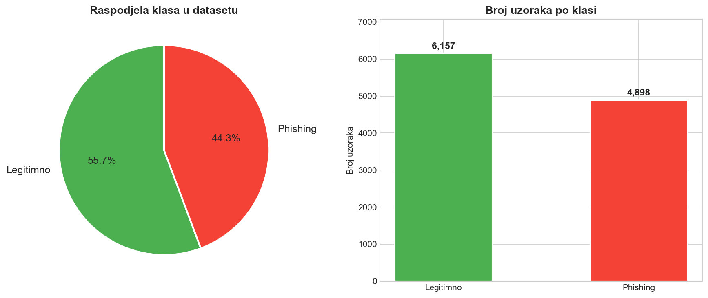
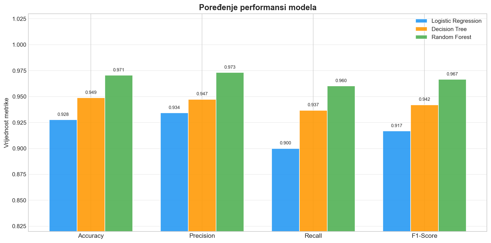
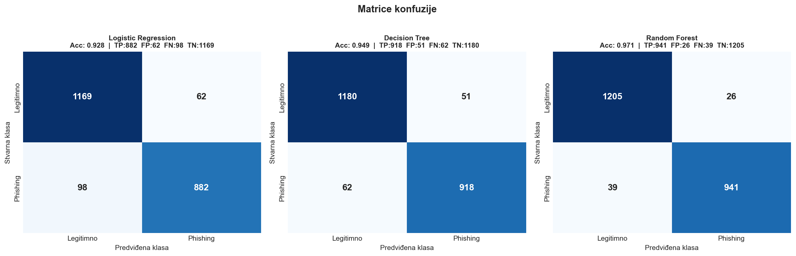
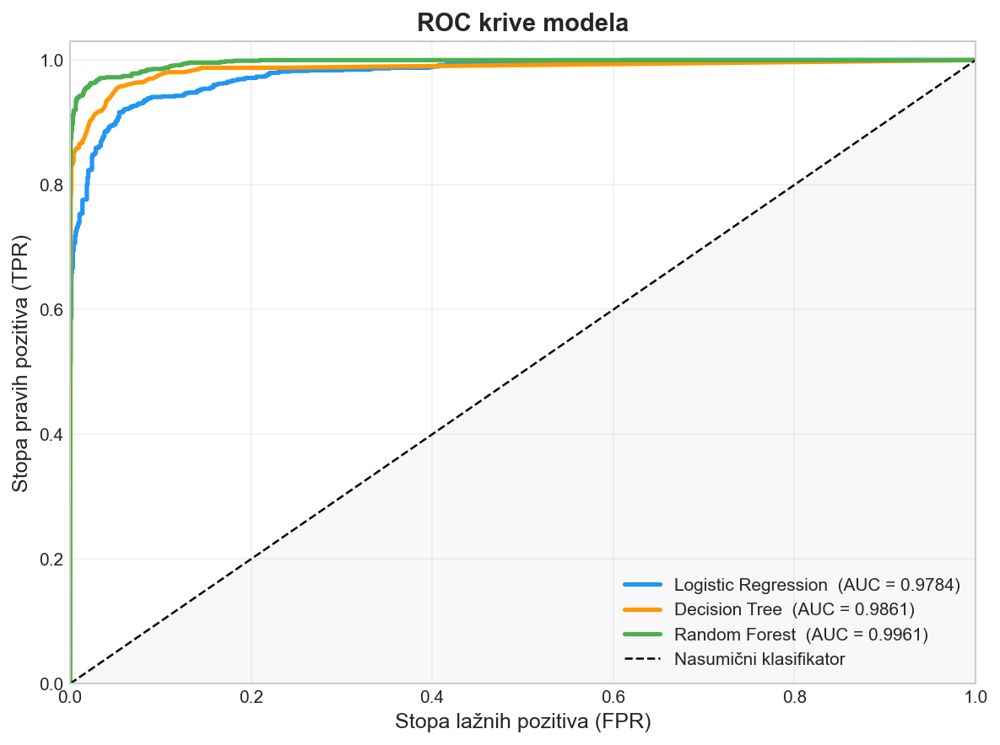
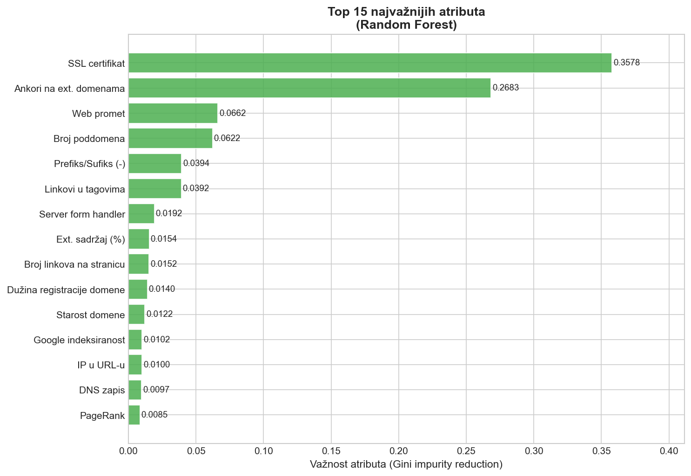
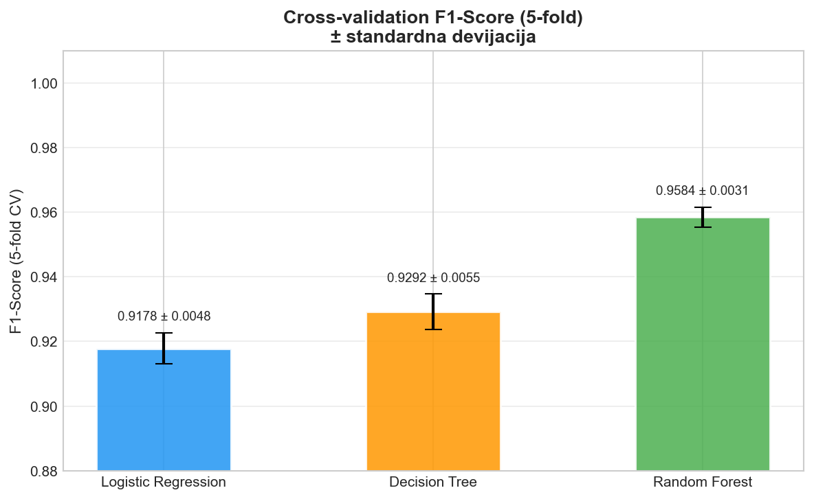

# Phishing Website Detection using Machine Learning

Comparison of three machine learning models for detecting phishing websites, trained on a dataset of 11,055 URLs with 30 extracted features.

## Results

| Model | Accuracy | Precision | Recall | F1-Score | AUC |
|---|---|---|---|---|---|
| Logistic Regression | 92.8% | 93.4% | 90.0% | 91.7% | 0.9784 |
| Decision Tree | 94.9% | 94.7% | 93.7% | 94.2% | 0.9861 |
| **Random Forest** | **97.1%** | **97.3%** | **96.0%** | **96.7%** | **0.9961** |

Random Forest achieved the best performance across all metrics. 5-fold cross-validation confirmed stability with F1-Score of 0.9584 ± 0.0031.

## Dataset

- **Source:** [UCI Phishing Websites Dataset](https://archive.ics.uci.edu/ml/datasets/Phishing+Websites)
- **Size:** 11,055 samples — 6,157 legitimate (55.7%), 4,898 phishing (44.3%)
- **Features:** 30 URL and website attributes (SSL certificate, domain age, anchor ratios, subdomains, etc.)
- **Format:** ARFF

Top predictive features (Random Forest):
1. SSL certificate presence (0.3578)
2. External domain anchors (0.2683)
3. Web traffic (0.0662)
4. Number of subdomains (0.0622)

## Visualizations

<table>
  <tr>
    <td><br><sub>Class distribution</sub></td>
    <td><br><sub>Model metrics comparison</sub></td>
  </tr>
  <tr>
    <td><br><sub>Confusion matrices</sub></td>
    <td><br><sub>ROC curves</sub></td>
  </tr>
  <tr>
    <td><br><sub>Top 15 feature importances (Random Forest)</sub></td>
    <td><br><sub>5-fold cross-validation F1-Score</sub></td>
  </tr>
</table>

## Project Structure

```
phishing-detection/
├── data/
│   └── phishing_dataset.arff
├── results/
│   ├── 01_class_distribution.png
│   ├── 02_metrics_comparison.png
│   ├── 03_confusion_matrices.png
│   ├── 04_roc_curves.png
│   ├── 05_feature_importance.png
│   ├── 06_cross_validation.png
│   └── model_performance.csv
├── phishing_detection.py
├── requirements.txt
└── README.md
```

## Setup

```bash
git clone https://github.com/AdnaKoss/phishing-detection
cd phishing-detection
pip install -r requirements.txt
python phishing_detection.py
```

## Tech Stack

Python · scikit-learn · pandas · NumPy · matplotlib · SciPy

## Limitations & Future Work

- The dataset (2015) reflects phishing patterns of its time; feature relevance may drift as attack techniques evolve.
- Models were evaluated on a single static dataset — no testing against live/streaming URLs.
- Future work: incorporate more recent phishing datasets, test ensemble/boosting methods (XGBoost, LightGBM), and explore lightweight models suitable for real-time browser extensions.

## Author

**Adna Kos** — Bachelor thesis, Software Engineering, University of Zenica (2026)  
[github.com/AdnaKoss](https://github.com/AdnaKoss)

Full thesis: [docs/Diplomski_rad_Adna_Kos.pdf](docs/Diplomski_rad_Adna_Kos.pdf)
